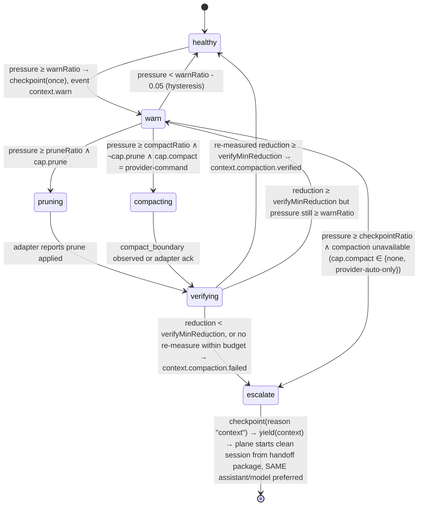

# Agentic OS — Kernel Services (M12–M15)

**Status:** Proposed — revision 1 (planning only; no production implementation in this pass)
**Date:** 2026-09-05
**Reconciled against:** `ai-control-plan` `main@77a0b79`, `cockpit` `main@337f9fa`
**Companion documents:** `docs/agentic-os-plan.md` (master plan, M0–M15 / O1–O12, Phases 6–10),
`docs/agentic-os-vnext-plan.md` (increments 1–17), `docs/execution-harness.md` (Harness),
`cockpit/docs/specs/E-agentic-os-role.md` (Cockpit side).

## 0. Why this document exists

The Agentic OS design so far composes a per-run agent (Composer, M2), runs it through the
Execution Harness, verifies, and learns which **assistant environment** works best. Four things a
kernel needs are missing or only implied:

| Service | One-line gap |
|---|---|
| **M12 Model Intelligence** | Routing picks an *assistant*; nothing picks a *model*, and there is no catalog of capacity, pricing or capability with provenance. |
| **M13 Deferred Execution / Scheduler** | A task either starts now or parks in `WAITING_INPUT` for a human. Nothing can wait for a time, a quota reset, a resource, or another task. |
| **M14 Context Lifecycle** | Context window pressure is neither measured nor acted on; the only remedy is a provider-side auto-compaction nobody observes. |
| **M15 Runtime Backend** | Adapters execute in-process by construction; the seam a second backend (persistent runtime, remote) would use is unnamed. |

This document is the architecture for those four, in the style of `execution-harness.md`: the
gap matrix against running code, the external-reference adoption matrix, the conflict decisions,
the domain types, state transitions, API boundaries, acceptance criteria and tests, and the
vertical slices. Roadmap placement lives in the two plan documents; this document does not
restate their increments.

**Separation this document enforces:** `runtime → harness → model → assets → context`.

```text
runtime   WHERE the provider process lives          (M15 seam; adapter manifest declares it)
harness   WHICH assistant environment executes      (existing router + adapters, unchanged)
model     WHICH model inside that environment       (M12, new stage after assistant eligibility)
assets    WHAT skills/MCP/fragments are attached     (increment 5 / Spec E, unchanged)
context   HOW MUCH of the window is in use, and what to do about it (M14, new Harness guard)
```

Each layer has one owner and one decision record; none decides for the layer above it. The
Harness still never selects an assistant or model (H-I1); the Control Plane still writes no
files; Cockpit still renders and returns bytes.

---

## 1. Gap matrix — CURRENT / PARTIAL / MISSING / CONFLICT

Every row cites the running code. "CONFLICT" means an accepted prior decision or an existing
component contradicts the mandate and §3 records the resolution.

### 1.1 M12 — Model Intelligence Service

| Capability | Status | Evidence |
|---|---|---|
| Assistant selection with persisted explanation | CURRENT | `apps/api/src/modules/router.ts`, `routing_decisions`; profiles `auto`/`preserve-quota`/`fastest`/`best-quality`/`lowest-tokens` |
| Model passed through to providers | CURRENT (plumbing only) | `RunSpec.model`, `ExecutionRequest.model`; `claude.ts:99` `model: run.model?.id`; `codex.ts:88` |
| Model-level auto-selection | **CONFLICT** | `plans/implementation-plan.md` "Deferred indefinitely: … model-level auto-selection"; `agentic-os-plan.md` §3.3 stage 2 says candidates widen to "assistant × model" — designed, unbuilt |
| Model catalog (capacity, pricing, capabilities) | MISSING | `CapabilityManifest.core.models` is two CLI aliases (`claude.ts:55`); no table, no pricing; standing deferral #3 (bounded cost caps) is blocked on exactly this |
| Pricing table | PARTIAL, wrong repo | `cockpit/modelPricing.ts` hand-maintained Anthropic list rates; nothing in the plane; `BudgetPolicy.pricingVersion` is contracted with no producer |
| Provider-official catalog data | PARTIAL | Claude SDK `ModelUsage.contextWindow`/`maxOutputTokens`/`costUSD` arrive in `result` messages and are already forwarded raw (`claude.ts:247 modelUsage`); `supportedModels()` exists in the SDK and is not called; Codex SDK exposes no catalog |
| External benchmark evidence (Artificial Analysis, LiveBench, BenchLM) | MISSING | none referenced anywhere; `telemetry.ts` comment: "No synthetic benchmark suite exists, and none should" — consistent (we consume published scores, we never run benchmarks) |
| Internal telemetry per assistant | CURRENT | `TelemetryService.scores()`: success, median duration, median tokens, test pass rate, failovers, 30-day window |
| Internal telemetry per **model** | MISSING | `runs` has no `model` column (`001_init.sql:67-76` + later `ALTER`s); model exists only in the `run.started` event payload |
| Task-dimension classification | PARTIAL | `classifyGoal()` → `coding \| review \| research \| general`; `verification-planner.ts` derives `impact:frontend` from changed files |
| Evidence provenance vocabulary | CURRENT (reuse) | `EvidenceSource` + `EVIDENCE_PRIORITY` (`capabilities.ts`), `evidence.observedAt`; review §3.4 decision: ordinal priority, **no fabricated confidence numbers** |

### 1.2 M13 — Deferred execution / Scheduler

| Capability | Status | Evidence |
|---|---|---|
| Immediate execution | CURRENT | `POST /api/tasks` → `CREATED → ROUTING → RUNNING` |
| Quota-reset knowledge | CURRENT | `CooldownStore.penalize(resetsAt)` with 1 h / 10 min fallback windows; `quota_snapshots`; router hard-filters on cooldown |
| All-candidates-limited handling | PARTIAL | `failoverTask()` parks in `WAITING_INPUT` and *names* the reset times (`describeWaits`); nothing wakes the task |
| Wake after quota reset | MISSING | `WAITING_INPUT → ROUTING` exists in the machine ("user asks to re-route, e.g. after quota reset") but is human-driven only |
| run-at / cron / dependency-complete for plane tasks | MISSING | no schedule entity, no wait condition, no timer other than `jobs.ts` |
| Timer loop with failure containment | CURRENT (pattern) | `jobs.ts scheduleDailyJobs`: `setTimeout` + always-reschedule + contained failures |
| Idle quota probe | PARTIAL / superseded note | Phase 3 note: "providers exposing quota only in run streams cannot be polled without violating the adapter contract". Probes already live *outside* the six-method contract (`capability-probe.ts`). Omarchy proves both providers expose an idle endpoint (§2) |
| `WAITING_RESOURCE` state | **CONFLICT** | 9-state machine is "a stable kernel … not extended" (vNext CR-14) |
| Dependency between tasks | PARTIAL | `parent_task_id` / `group_id` columns exist with no producer (vNext §3.5); increment 11 plans a subtask DAG |
| Schedule UI | CURRENT, different scope | Cockpit Schedule tab manages *Cockpit's own* jobs: Claude desktop `scheduled-tasks.json`, launchd/systemd units, cloud crontab (`cloudSchedule.ts`, `scheduleMeta.ts`, `server.ts:5257+`). None of it schedules plane tasks |
| Re-composition at wake | CURRENT (reuse) | `failoverTask()` already checkpoints → re-routes → starts a fresh session from the handoff prompt. Wake is that path without the cooldown penalty |

### 1.3 M14 — Context Lifecycle Manager

| Capability | Status | Evidence |
|---|---|---|
| Context-window capacity per session | PARTIAL | Claude: `ModelUsage.contextWindow` forwarded raw in `usage.updated`; Codex SDK: none — capacity must come from the M12 catalog |
| Measured tokens in context | PARTIAL | Claude SDK: `SDKContextUsage` via the `get_context_usage` control request (`total_tokens`, `raw_max_tokens`, `percentage`, per-category breakdown, `over_limit`) — not consumed; Codex: per-turn `Usage.input_tokens + cached_input_tokens` is the prompt size of that turn — usable as an estimate, not consumed |
| Context pressure policy (healthy → warn → prune → compact → verify → checkpoint) | MISSING | no guard, no events; `BudgetGuard`/`QuotaGuard` in `session-runner.ts` are the seam |
| Prune | MISSING, and partly *impossible* for CLI providers | the provider owns its transcript; the plane can only (a) bound what it injects, (b) ask for compaction, (c) start a clean session from a checkpoint |
| Compact | PARTIAL | Claude SDK emits `compact_boundary` system messages and has a compaction window; the adapter drops them. Codex SDK has no compaction surface (the `/compact` command exists in the Codex TUI only) |
| Verify reduction | MISSING | nothing re-measures |
| Checkpoint + clean session from a handoff package | CURRENT | `CheckpointService`, `renderHandoffPrompt`, `origin:{kind:"fresh"}` start; `deferral #6` (provider `resume()` under flag-ON) is unwired and is **not** what M14 needs — resume carries the full context back |
| Immutable checkpoint/audit history under compaction | CURRENT (invariant) | append-only `events`, immutable `checkpoints`; compaction is provider-side and never touches them |
| Live context gauge (O10) | MISSING | `apps/web` Usage tab shows tokens in/out only; Cockpit has no context concept |
| Legacy path parity | not applicable | M14 is built on the Harness path only (CR-4); the legacy `orchestrator.ts` path gets nothing, which is one more reason to finish increment 6 |

### 1.4 M15 — Runtime Backend abstraction

| Capability | Status | Evidence |
|---|---|---|
| In-process native SDK execution | CURRENT | `ClaudeAdapter` (Agent SDK), `CodexAdapter` (SDK spawns the CLI), `BedrockAdapter`, `CursorAdapter`, `OpenRouter` via Codex |
| Isolation tier declared and reported | CURRENT | `harness.processIsolation`, `ExecutionResult.enforcement.isolation` |
| Runtime kind declared | PARTIAL | `providerDetail.runtime: "claude-agent-sdk"` on one adapter only; not a typed field |
| Provider session survives plane restart | PARTIAL | `HarnessRecovery` offers resume for resume-capable sessions; consumption unwired (deferral #6) |
| Detach/reattach an interactive session | CURRENT, in Cockpit | `cockpit/pty.ts` PTY attach for observed sessions; not a managed-execution feature |
| Remote runner | DEFERRED, correctly | Phase 8; contracts carry the keys (`ExecutionTarget`) |
| A `RuntimeBackend` interface | MISSING, and **one implementation exists** | building an interface for one implementation is exactly what `AGENTS.md` / the standing rules forbid; §4.4 names the seam without abstracting it yet |

---

## 2. External reference adoption matrix

Verdict vocabulary: **KEEP CURRENT** (we already have it, keep ours) · **BORROW DESIGN** (copy
the idea, not the code) · **INTEGRATE OPTIONAL** (an adapter/skill/backend behind config, never
core) · **REPLACE CURRENT** (theirs is better; swap) · **REJECT**.

Inspected at: deepseek-harness `d347e70` (0.1.3-alpha.1), herdr `af7e189`, agent-room `3593f19`,
archify `d8e4daf` (2.17.0-dev.1), omarchy `e8e92c5` — all 2026-09-04/05.

### 2.1 DeepSeek Harness (`dsh`) — major architecture reference

| Feature | Verdict | Reason |
|---|---|---|
| Everything-is-a-plugin (Cordis) core | REJECT | The plane's seams are fixed and few (adapters, verifiers, sinks, guards). A plugin kernel is architecture for a product that *is* a harness; ours is a control plane over foreign harnesses. Standing rule: no interface with one implementation. |
| **Profiles = ordered bundle layers + patch; `--dump-config` prints the resolved tree** | BORROW DESIGN | This is our `AgentSpec`/`CompositionDecision` in another vocabulary: layered, inspectable, replayable composition. Borrow the *dump* idea: every composed run must be able to print its resolved composition. Already the intent of M7; make it an acceptance criterion of increment 5. |
| Per-agent `preset` mounted under an agent scope | BORROW DESIGN | Same as our per-run ephemeral profile (A6). Confirms the ownership split. |
| **Compaction family** (`compaction-basic` + `tool-result-pruner` + `/compact`): threshold 0.8 of routed window, retain newest 16 %, prune before summarize, skip summary if pruning relieved pressure, overflow-error recovery with one maximal reduction, `compaction/start`→`summary`→`end` bracket as durable events, "one token meter prices every decision", re-measure after acting | **BORROW DESIGN (major)** | §4.3 policy ladder, thresholds, ordering, verification-by-re-measure and the audit bracket are lifted from here. What we cannot borrow: dsh compacts *its own* session log; for Claude/Codex the transcript belongs to the provider, so our "prune"/"compact" are adapter capabilities and the escalation is checkpoint + clean session. |
| Tool-output **spill** (oversized tool text to a file + locator) | REJECT for now | Applies to a harness that owns tool results. Our injected content (handoff prompt, bundle) is already size-bounded. Revisit only if a `DshAdapter` lands. |
| `goal-round-driver` (same-session goal continued in rounds) | KEEP CURRENT | Our continuation unit is checkpoint → handoff package → new session; it is provider-neutral and survives failover, which rounds inside one session do not. |
| `schedule` package (session-local reminders) | REJECT | Reminders delivered as chat messages inside one session. Not task scheduling. M13 is a plane-level scheduler over durable tasks. |
| `jobs` (background jobs a model can start/collect) | REJECT | Model-facing background work inside one session. The plane's unit is the task; subtasks arrive in increments 10–11. |
| Session projections (fold events into typed state) | KEEP CURRENT | `state-vocab.ts` read-time derivation and `EvidenceBundle` are the same pattern. |
| Agent Teams (roster, task board, mailbox) | REJECT | See Agent Room row: the Harness rule "a running agent never spawns sessions" stands. |
| **dsh as an assistant environment** (SDK JSON-RPC server, `--profile sdk`, ACP; hosts Claude Code/Codex as subagents) | INTEGRATE OPTIONAL | A `DshAdapter` fits the six-method contract (start/resume over the SDK, `session/event` → normalized events, approvals via its approval seam). Its token meter and `/compact` would give M14 `measure: "provider-reported"` and `compact: "provider-command"`. Not a control-plane replacement, not a dependency. Build only when a task class needs a DeepSeek model with a real harness; OpenRouter-in-Codex already covers "evaluate a model". |

### 2.2 Herdr — persistent runtime reference

| Feature | Verdict | Reason |
|---|---|---|
| Background server owns PTYs; close the lid, reattach later | INTEGRATE OPTIONAL (M15 backend `herdr`), not now | Solves "the interactive terminal survives"; our managed runs are SDK streams, not terminals, and `HarnessRecovery` + provider `resume()` is the restart story. The gap herdr would close is *interactive* attach to a managed run — today a Cockpit PTY feature for *observed* sessions. No evidence a managed run needs it. |
| working / blocked / idle by **screen-tail regex** (`src/detect`) | REJECT as a state source; BORROW the vocabulary for observed sessions only | Heuristic over terminal text. Cockpit already infers richer `RuntimeStatus` (`WAITING_APPROVAL`, `WAITING_USER`, …) from hooks with `{source, confidence}` (CR-2). Managed sessions have canonical states. |
| Socket API `wait` (block until a pane's output matches / another agent is blocked) | BORROW DESIGN → M13 `dependency-complete` | The useful idea is "wake on another agent's state", which for us is "wake when task X reaches a terminal state". Delivered by the scheduler, not by polling a pane. |
| Agent resume plans (`AgentResumePlan`: agent, argv, dedupe key) | KEEP CURRENT | We hold `providerSessionRef` + `canResume` per adapter; deferral #6 is the wiring, not a design gap. |
| Server handoff during replacement (`HandoffRuntimeState`) | KEEP CURRENT | Our restart safety is lease fencing + boot reconciliation over durable rows. |

### 2.3 Agent Room — inter-agent protocol reference

| Feature | Verdict | Reason |
|---|---|---|
| Structured markers `[DECISION] [TODO] [STATUS] [RESULT]` extracted into artifacts | BORROW DESIGN | Our `TaskEnvelope` already has `decisions` (provenance-tagged), `completed`, `remaining`, `nextAction`, derived from events (`envelope-derivation.ts`). Borrow the *explicit* marker grammar as an optional, provider-neutral way for an agent to report decisions and results in its messages, so derivation stops guessing from prose. Small addition to `deriveEnvelopeUpdate`; no new entity. |
| Evidence-gated task board (claim → submit with evidence → verified by a **different** agent) | KEEP CURRENT + BORROW one rule | Verification with evidence, verdict separate from execution, is already stronger here (H-I6, `EvaluationResult`, artifacts). Borrow the rule: a `review`/`evaluator` check may require `verifier ≠ implementer` (different assistant *or* different session). Goes into `VerificationPlanner` selection rules; lands with the first `evaluator` provider (vNext §8). |
| Task turn lease (CAS grant, holder-only renew/release, expiry sweep, ordered ledger) | KEEP CURRENT | `handoff_envelopes` claim protocol + `uq_live_successor` + session lease fencing are the same mechanics (deferral #7 wires them). |
| Presence (`listening` / `online` / `idle`) and long-poll listen loop | REJECT | Presence is for peers in a chat. Our agents do not talk to each other. |
| Turn discipline (`open` / `sequential` / `moderator`) | REJECT | Same reason. |
| **Webhook wake-up** (resident agents sleep; a signed POST wakes them) | BORROW DESIGN → M13 | The scheduler is the plane's wake-up service: tasks in `WAITING_RESOURCE` sleep for free and are woken by a durable condition, never by polling. An inbound webhook is a legitimate future *source* of a wake (`resource-available` from an external system) — off the roadmap until a real integration asks. |
| Shared room as the coordination bus | REJECT | Orchestration stays in the Control Plane (Harness §11: fan-out/fan-in lives in the plane; agents report new work in the envelope and never spawn sessions). |
| Exportable report (minutes / ADR / PR description) | KEEP CURRENT | `progress.md` / `handoff.md` are rendered projections; increment 13 adds structural progress. |

### 2.4 Archify — Cockpit Asset Registry candidate

| Feature | Verdict | Reason |
|---|---|---|
| Agent skill (`npx skills add tt-a1i/archify -g`) producing typed JSON IR → deterministic self-contained HTML/SVG (architecture, workflow, sequence, dataflow, lifecycle); snapshot diff Before/Delta/After | INTEGRATE OPTIONAL as a **registry asset** | Fits Cockpit's existing skill install path (`install.ts`, `skillsInstall.ts`) and proposals inbox; no plane code. Tag it `architecture, system-design, refactor, review`. Composer (increment 5) attaches it when M12's task dimensions score `architecture` high, subject to the digest allowlist like every other asset. Its update-check GET is opt-out (`ARCHIFY_UPDATE_CHECK_DISABLED=1`) — set it in the per-run profile. |
| Using Archify for *this* document's diagrams | REJECT here | It renders standalone HTML; the repos' design corpus is Markdown with ASCII/mermaid, and Archify is not installed on this machine. Recommend it for the Cockpit "system map" view once it is a registry asset. |

### 2.5 Omarchy — OS-shell / UX reference

| Feature | Verdict | Reason |
|---|---|---|
| **Agents panel: per-subscription 5-hour / weekly utilisation + reset time, refreshed every 15 min, merged across machines** | BORROW DESIGN (UX) + **BORROW the probes** (M13 quota-available) | `bin/omarchy-agent-usage-claude` reads the OAuth token from `~/.claude/.credentials.json` and GETs `https://api.anthropic.com/api/oauth/usage` (`anthropic-beta: oauth-2025-04-20`) → `five_hour` / `seven_day*` buckets with `utilization` and `resets_at`. `bin/omarchy-agent-usage-codex` asks the Codex app-server RPC `account/rateLimits/read` → `primary`/`secondary` windows with `usedPercent`, `windowDurationMins`, `resetsAt`. Both are idle probes, both use the provider's own credentials in place, both map onto `QuotaWindowState`. This is the concrete reusable functionality that justifies touching Omarchy at all. |
| `omarchy agent prompt "…"` launches the default agent unattended | REJECT | Shell convenience; the plane's intake is the API. |
| Crash → hand the core dump to an agent with a diagnose skill | REJECT (idea noted) | A future `resource-available`/webhook wake source at most. |
| One skill symlinked into every harness's skill directory | KEEP CURRENT | Cockpit already installs per assistant with assistant-specific locations (`assistantAdapters.ts`). |
| Theme sync, top bar, menus | REJECT | No reusable functionality for the plane. |

### 2.6 Benchmark sources (M12 cold-start priors)

| Source | What it gives | Access | Constraint |
|---|---|---|---|
| Provider-official | model ids, context window, max output, pricing, capabilities | Claude SDK `supportedModels()` + `ModelUsage`; Anthropic/OpenAI pricing pages | authoritative for capacity/price; **highest non-telemetry tier** |
| Artificial Analysis | `artificial_analysis_intelligence_index`, `_coding_index`, `_math_index`, LiveCodeBench, GPQA, MMLU-Pro, `price_1m_input/output_tokens`, `median_output_tokens_per_second`, `median_time_to_first_token_seconds` | REST, `x-api-key`, free tier 1 000 req/day | **attribution required** ("https://artificialanalysis.ai/"); ids stable, slugs drift |
| LiveBench | category scores: coding (incl. agentic coding), reasoning, math, language, data analysis, instruction following | HuggingFace datasets + `all_groups.csv`/`all_tasks.csv` produced by its scripts; leaderboard site | monthly question releases; verify license in repo before shipping a fetcher |
| BenchLM | 8 weighted categories (agentic, coding, reasoning, multimodal, knowledge, multilingual, instruction following, math); context window and output price per model | website + "/data" dataset download; **no documented API** | treat as a manually refreshed snapshot until an API exists |

None of these is fetched on the routing path. They are refreshed by the existing daily job,
stored with provenance and TTL, and read from SQLite.

---

## 3. Conflict and overlap decisions — KEEP vs REPLACE

Numbering continues vNext CR-1…CR-15.

### CR-16 — `WAITING_RESOURCE` vs "the 9-state task machine is not extended" (CR-14)
- **A:** keep 9 states; express scheduler waits as `WAITING_INPUT` with a reason field.
- **B:** add one state, `WAITING_RESOURCE`, for waits the **scheduler** resolves.
- **Decision:** **REPLACE A with B — exactly one new state.** CR-14's rule is narrowed, not
  reversed: *outcomes and verdicts never become states* (still true); *a lifecycle wait with a
  non-human resolver is a state*.
- **Reason:** `WAITING_INPUT` means "a person must act". Putting scheduler waits there makes the
  board lie: the operator cannot tell "needs me" from "resumes at 06:53". The state is also the
  scheduler's ownership boundary — only the scheduler may leave it. One state covers time,
  cron-created gating, quota, resource and dependency waits because they share one shape: a
  durable `WaitCondition` with a computable next check.
- **Cost:** the transition matrix tests, `apps/web` board, Cockpit's state list and API 2.x
  contract all gain one enum member. Additive under the 1a compatibility policy (unknown enum
  member tolerated; minor bump to 2.1).
- **Migration:** none for rows; `WAITING_RESOURCE` has no existing producer.

### CR-17 — Model-level auto-selection was "deferred indefinitely"
- **Decision:** **REPLACE the deferral** (`plans/implementation-plan.md`) with M12.
- **Reason:** the deferral predates: per-run usage with `modelUsage`, the AgentSpec
  `model: {primary, fallbacks}` field, and a request that names model selection as kernel
  scope. The synthetic-benchmark half of that deferral **stays deferred**: we consume published
  scores, we never spend subscription quota running benchmarks.

### CR-18 — Routing profiles vs task-dimension weights
- **Decision:** **KEEP profiles, as named weight presets.** `fastest` = speed, `lowest-tokens` =
  token-efficiency, `preserve-quota` = quota-preservation, `best-quality` = coding+reasoning+review,
  `auto` = balanced. No second concept; the existing `profile` field on `tasks` is the API.

### CR-19 — Two pricing tables (Cockpit `modelPricing.ts` vs M12 catalog)
- **Decision:** **plane catalog is authoritative** once `models.read` ships; Cockpit's table
  becomes its offline fallback and is deleted with M11 usage unification.
- **Reason:** `BudgetPolicy.pricingVersion` is a plane contract; cost caps (deferral #3) and the
  Economics Ledger (§3.7 of the master plan) both need one versioned source.

### CR-20 — Cockpit Schedule tab vs the plane Scheduler
- **Decision:** **KEEP both, distinct sources.** Cockpit's tab keeps owning Cockpit jobs (scans,
  retros, Claude desktop `scheduled-tasks.json`, launchd/systemd, cloud crontab). It gains a
  **read** of plane schedules and `WAITING_RESOURCE` tasks (`schedules.read`) and may **create**
  plane schedules only through `commands.write`. Execution semantics, next-fire computation,
  wake and re-composition are plane-only. Cockpit reuses `humanizeCron` / `classifyJobPurpose`
  for rendering.

### CR-21 — `classifyGoal` (4 kinds) vs `TaskDimension` (11 dimensions)
- **Decision:** **REPLACE** with a deterministic `classifyTask()` producing dimension weights;
  `classifyGoal` remains as a derived projection so `TelemetryService.scores(taskKind)` keeps
  working until it reads dimensions.

### CR-22 — "Idle quota cannot be polled without violating the adapter contract" (Phase 3 note)
- **Decision:** **REPLACE the note.** Probes already sit outside the six-method contract
  (`capability-probe.ts`). A `QuotaProbe` per provider (Omarchy's two endpoints) is a probe, not
  an adapter method. Manifest `reportsLimits` stays honest: Codex flips to `true` only via the
  app-server probe, and the probe's `EvidenceSource` is `provider-api`, ranked below
  `runtime-probe` (a live run stream).

### CR-23 — Dependency-complete waits vs increment 11's subtask DAG
- **Decision:** **MERGE.** M13 ships the primitive "wake when task X reaches a terminal state"
  (flat, any task). Increment 11's DAG scheduling is built on it; it adds cycle rejection and
  skip-with-reason, not a second wait mechanism.

### CR-24 — `jobs.ts` daily timer vs the Scheduler timer
- **Decision:** **KEEP `jobs.ts` until the Scheduler has soaked, then fold** the daily sync and
  retention into `system` schedules in a separate no-behaviour-change commit. Two timer loops for
  one release is cheaper than a big-bang.

### CR-25 — `yield.kind` growth for context pressure
- **Decision:** **add `"context"`** to `ExecutionResult.yield.kind` and the guard directive
  `yield(kind)` union. Additive; reason strings are not a vocabulary.

### CR-26 — Provider `resume()` (deferral #6) vs M14's clean-session escalation
- **Decision:** **distinct, both kept.** `resume()` continues the *same* provider context (no
  reduction) and is right after a plane crash. M14's last rung must start a **fresh** session
  from the handoff package precisely to shed context. M14 therefore does not wait on deferral #6.

### CR-27 — O10 optional gauge vs M14
- **Decision:** **REPLACE**: O10 moves into M14's mandatory scope (both the `apps/web` Usage tab
  and Cockpit's managed session view). O9 (cheap-model pre-flight) folds into M12 as a selection
  outcome; its "SDK-direct single-model run" half stays deferred.

### CR-28 — Herdr / dsh as mandatory runtime
- **Decision:** **REJECT mandatory; INTEGRATE OPTIONAL later** (§2). M15 names the seam; no
  abstraction with one implementation.

### CR-29 — `WAITING_INPUT` park when no wake is computable
- **Decision:** the scheduler may only take a task into `WAITING_RESOURCE` when it can compute a
  next check (`notBefore`, a task id, a named resource, or a cooldown `until`). `CooldownStore`
  always yields an `until` (fallback windows), so the all-limited case always qualifies; after
  `maxAutoWakes` (default 3) consecutive wakes that re-park, the task falls back to
  `WAITING_INPUT` with the history attached. Humans are never bypassed forever.

---

## 4. Architecture

### 4.1 Placement

```text
                     Cockpit (renders schedules · context gauge · model catalog; never executes)
                                            │ API 2.1 (additive caps: models.read, schedules.read, context.read)
   ┌────────────────────────────────────────┴────────────────────────────────────────┐
   │ CONTROL PLANE                                                                    │
   │  intake ─► [Scheduler M13] ─► routing: assistant eligibility (existing)          │
   │                 ▲                 └─► [Model Intelligence M12] ─► assistant×model │
   │                 │                          └─► (increment 5) assets/composition   │
   │   wake conditions: time · cron · quota(cooldowns, quota_snapshots, QuotaProbe)   │
   │                   · resource(slots) · dependency(task terminal)                  │
   │   Model catalog + evidence (provider-official · external priors · own telemetry)│
   └────────────────────────────────────────┬────────────────────────────────────────┘
                                            │ ExecutionRequest (model + contextPolicy + capacity)
   ┌────────────────────────────────────────┴────────────────────────────────────────┐
   │ EXECUTION HARNESS                                                                │
   │  SessionRunner guards: Budget · Timeout · ToolPolicy · Approval · Quota          │
   │                        + ContextPressureGuard (M14)                             │
   │  ContextMeter (one per session) ◄── adapter context capability (measure/compact)│
   │  escalation: warn → prune → compact → verify → yield(context) → plane restarts  │
   │  clean session from checkpoint (existing handoff path)                          │
   └────────────────────────────────────────┬────────────────────────────────────────┘
                                            │ AgentAdapter (unchanged 6 methods)
                     runtime kind declared on the manifest (M15 seam): native-sdk | local-process
```

### 4.2 M13 — Scheduler

**Entities.**

```ts
/** Attached to a task; exactly one active condition per task. Durable. */
interface WaitCondition {
  schemaVersion: 1;
  taskId: TaskId;
  kind: "time" | "quota" | "resource" | "dependency";
  /** kind=time: absolute ISO instant. Also the earliest re-check for every other kind. */
  notBefore?: string;
  /** kind=quota: assistants whose cooldown/quota must clear; empty = any eligible assistant. */
  assistants?: AssistantId[];
  /** kind=resource: named slot, e.g. "concurrency:personal-claude" (slots from `assistants.<id>.maxConcurrent` in config.yaml; default unlimited). */
  resource?: string;
  /** kind=dependency: wake when every listed task is terminal. */
  dependsOn?: TaskId[];
  /** What to do when a dependency ends FAILED/CANCELLED. */
  onDependencyFailure: "cancel" | "wake-anyway" | "wait-input";
  createdBy: "user" | "scheduler" | "failover";
  createdAt: string;
  /** Times the scheduler woke this task and had to re-park it (CR-29). */
  autoWakes: number;
  /** Set when satisfied; the transition to ROUTING is CAS-guarded on this. */
  satisfiedAt?: string;
  reason: string;
}

/** A recurring template. Firing CREATES a task; it never mutates one. */
interface Schedule {
  schemaVersion: 1;
  scheduleId: string;
  kind: "user" | "system";
  goal: string;
  profile: RoutingProfile;
  constraints: string[];
  repository?: { path: string; branch?: string };
  cron: string;               // 5-field
  timezone: string;           // IANA
  enabled: boolean;
  overlap: "skip" | "queue";  // skip = do not fire while the previous task is non-terminal
  gate?: Omit<WaitCondition, "taskId" | "createdBy" | "createdAt" | "autoWakes">; // e.g. quota
  lastFiredAt?: string;
  nextFireAt?: string;        // persisted; recomputed on boot and after every fire
  lastTaskId?: TaskId;
  createdAt: string;
}
```

**Invariant (I-S1): a schedule or wait condition stores intent, never a chosen assistant or
model.** Re-composition at execution time is guaranteed because the only path out of
`WAITING_RESOURCE` is `ROUTING`, which runs the full router (assistant eligibility → M12 model
selection → composition when increment 5 lands) against *current* cooldowns, quota, catalog and
telemetry. A `userOverride` assistant on the task is honoured as today (it is a filter, not a
frozen choice: if it is still limited at wake, the task re-parks).

**Task state machine — one added state, seven added edges.**

```mermaid
stateDiagram-v2
    [*] --> CREATED
    CREATED --> ROUTING
    CREATED --> WAITING_RESOURCE : schedule attached (run-at / quota / dependency)
    CREATED --> CANCELLED
    ROUTING --> RUNNING
    ROUTING --> WAITING_INPUT : no eligible candidate and no computable wake
    ROUTING --> WAITING_RESOURCE : no eligible candidate, wake computable (CR-29)
    ROUTING --> FAILED
    ROUTING --> CANCELLED
    RUNNING --> WAITING_INPUT
    RUNNING --> LIMIT_PAUSED
    RUNNING --> HANDING_OFF
    RUNNING --> COMPLETED
    RUNNING --> FAILED
    RUNNING --> CANCELLED
    LIMIT_PAUSED --> HANDING_OFF
    LIMIT_PAUSED --> WAITING_INPUT
    LIMIT_PAUSED --> WAITING_RESOURCE : all candidates limited; wait for earliest reset
    LIMIT_PAUSED --> CANCELLED
    WAITING_INPUT --> RUNNING
    WAITING_INPUT --> ROUTING
    WAITING_INPUT --> HANDING_OFF
    WAITING_INPUT --> WAITING_RESOURCE : operator: "continue when quota resets / run tonight"
    WAITING_INPUT --> COMPLETED
    WAITING_INPUT --> FAILED
    WAITING_INPUT --> CANCELLED
    WAITING_RESOURCE --> ROUTING : condition satisfied, or operator "run now" (re-compose)
    WAITING_RESOURCE --> WAITING_INPUT : maxAutoWakes exceeded / dependency failed with wait-input
    WAITING_RESOURCE --> CANCELLED
    HANDING_OFF --> RUNNING
    HANDING_OFF --> WAITING_INPUT
    HANDING_OFF --> FAILED
    HANDING_OFF --> CANCELLED
```



Triggers (added to the transition table's comments, in the style of `SESSION_TRANSITION_TRIGGERS`):

| Edge | Trigger |
|---|---|
| `CREATED → WAITING_RESOURCE` | `schedule_attached` |
| `ROUTING → WAITING_RESOURCE` | `no_candidate_wake_computable` |
| `LIMIT_PAUSED → WAITING_RESOURCE` | `all_limited_wait_for_reset` (replaces today's `→ WAITING_INPUT` when CR-29 qualifies; the checkpoint is taken first, as now) |
| `WAITING_INPUT → WAITING_RESOURCE` | `operator_deferred` |
| `WAITING_RESOURCE → ROUTING` | `condition_satisfied` / `operator_run_now` |
| `WAITING_RESOURCE → WAITING_INPUT` | `auto_wake_budget_exhausted` / `dependency_failed` |
| `WAITING_RESOURCE → CANCELLED` | `cancel_requested` |

`ExecutionSessionState` is **unchanged**. A session that yields on quota already ends `YIELDED(limit)`; the plane decides to wait.

**Scheduler service (Control Plane, single process, no queue).**

```text
Scheduler
  ├─ armTimer(): one setTimeout for min(nextFireAt over enabled schedules, notBefore over conditions)
  │              unref'd, always re-armed, failures contained (jobs.ts pattern)
  ├─ onTick():   fire due schedules (create tasks, overlap policy, recompute nextFireAt);
  │              evaluate due conditions
  ├─ onEvent():  task terminal → evaluate dependency conditions naming it
  │              cooldown cleared / quota snapshot improved → evaluate quota conditions
  │              session terminal → release resource slots → evaluate resource conditions
  ├─ evaluate(condition): satisfied? → CAS satisfiedAt → tasks.transition(WAITING_RESOURCE→ROUTING)
  │              → Orchestrator.resumeFromWait(taskId)  (= failoverTask's route+start without the penalty)
  │              not satisfied → set next notBefore (earliest cooldown.until / re-check interval), autoWakes++
  └─ reconcileOnBoot(): recompute nextFireAt for every enabled schedule from lastFiredAt + cron;
                        fire at most ONE missed occurrence per schedule (catch-up policy),
                        re-arm every condition, never double-create a task (lastTaskId + non-terminal check)
```

`resumeFromWait` reuses the existing chain: latest checkpoint → `routeFor()` (cooldowns apply,
no exclusion) → `persistRoutingDecision` → `startTask(..., {trigger: "wake"})`; a fresh session
from the handoff prompt, or `resume()` on the same assistant once deferral #6 is wired and M14
reports the context healthy. `handoffs.trigger` gains the value `wake`.

**Quota knowledge sources, in evidence order:** (1) `limit.hit` / `usage.updated` quota payloads
from live runs → `cooldowns.until` and `quota_snapshots` (`runtime-probe`); (2) `QuotaProbe`
idle endpoints (Omarchy §2.5) run by the daily job and *on demand when a quota condition is due*
(`provider-api`), rate-limited to one probe per assistant per 15 min; (3) fallback windows
(`manual`). A wake on a quota condition re-checks (2) before routing so a stale cooldown never
starts a run into a still-exhausted window.

**Cron evaluation.** Adding one small dependency for 5-field cron with timezone/DST-correct
next-fire (`cron-parser` or `croner`) is justified: next-fire arithmetic is a known bug farm and
no installed dependency computes it (Cockpit's `cronstrue` only humanises). Recorded as the one
new dependency of M13.

**Ownership.** Plane: `schedules`, `wait_conditions`, next-fire, wake, re-composition, catch-up.
Cockpit: renders both alongside its own jobs; creates via `commands.write`; never computes
next-fire itself.

**Persistence.** Migration `014_scheduler.sql` (numbers here are placeholders — assign at merge, forward-only): `schedules` (columns above, `next_fire_at`
indexed), `wait_conditions` (one active row per task enforced by a partial unique index on
`task_id WHERE satisfied_at IS NULL`), `tasks.schedule_id TEXT NULL`, `handoffs.trigger` CHECK
extended with `wake`.

**API (additive, 2.1).**

```text
POST   /api/tasks                       body gains `schedule?: WaitConditionInput`  → task starts in WAITING_RESOURCE
POST   /api/tasks/:id/wait              attach/replace a condition (from WAITING_INPUT or LIMIT_PAUSED)   commands.write
POST   /api/tasks/:id/run-now           WAITING_RESOURCE → ROUTING immediately                             commands.write
GET    /api/schedules                   list (+ nextFireAt, lastTaskId)                                     schedules.read
POST   /api/schedules · PATCH /:id · DELETE /:id                                                            commands.write
GET    /api/scheduler/status            armed timer, due conditions, last tick, probe freshness             schedules.read
SSE    task.state (existing) carries WAITING_RESOURCE + the condition summary
```

### 4.3 M14 — Context Lifecycle Manager

**Capability declaration (adapter manifest, `harness.context`).** Honest tiers, like isolation:

```ts
interface ContextCapability {
  /** How the Harness learns the tokens in the provider's context. */
  measure: "provider-reported" | "estimated" | "none";
  /** Capacity source. "catalog" means M12 supplies it from the model catalog. */
  capacity: "provider-reported" | "catalog" | "unknown";
  /** Adapter can shrink the transcript without a model call (tool-result trimming). */
  prune: boolean;
  /** Adapter can ask the provider to summarise in place. */
  compact: "provider-command" | "provider-auto-only" | "none";
  /** Adapter can start a clean session that inherits nothing. Always true for our adapters. */
  fork: boolean;
  /** Provider auto-compaction happens without our request; we can only observe it. */
  observesAutoCompaction: boolean;
}
```

Expected declarations at implementation time (to be **verified**, not asserted, per deferral #4):

| Adapter | measure | capacity | prune | compact | observesAutoCompaction |
|---|---|---|---|---|---|
| Claude (Agent SDK) | provider-reported (`get_context_usage` → `SDKContextUsage`) | provider-reported (`ModelUsage.contextWindow`) | false | provider-command if the SDK accepts `/compact` as streaming input — **verify**; else provider-auto-only | true (`compact_boundary`) |
| Codex (SDK) | estimated (last turn `input_tokens + cached_input_tokens`) | catalog | false | none (TUI-only command) | false |
| Cursor / Bedrock | none | catalog / unknown | false | none | false |
| Fake | provider-reported (scripted) | provider-reported | true | provider-command | true |

**Measurement.** One `ContextMeter` per session (dsh: "one measurement service prices every
decision"). It produces a `ContextMeasurement` on every `usage.updated`, on every explicit probe
the guard requests, and after every compaction:

```ts
interface ContextMeasurement {
  sessionId: ExecutionSessionId;
  at: string;
  model: string;
  capacityTokens?: number;
  usedTokens: number;
  method: "provider-reported" | "estimated";
  /** Present when estimated: how, so the gauge can show its method chip (Spec E M9 precedent). */
  estimator?: { name: string; version: string; charsPerToken?: number };
  /** usedTokens / capacityTokens; undefined when capacity unknown. May exceed 1. */
  pressure?: number;
  health: "healthy" | "warn" | "critical" | "exceeded" | "unknown";
  breakdown?: Array<{ category: string; tokens: number }>;   // Claude categories / mcp tools / memory files
  sequence: number;   // monotonic per session
}
```

**Policy (Control Plane defines, per workspace; Harness enforces).**

```ts
interface ContextPolicy {
  warnRatio: 0.70;        // eager checkpoint once; gauge turns amber
  pruneRatio: 0.80;       // ask adapter to prune (if capable)
  compactRatio: 0.85;     // ask adapter to compact (if capable); dsh default is 0.8 — we act one rung earlier via prune
  checkpointRatio: 0.92;  // critical: checkpoint + yield(context) if compaction unavailable or unverified
  verifyMinReduction: 0.15;   // a compaction that frees < 15 % of capacity counts as failed
  maxCompactionsPerSession: 3;
  minTurnsBetweenActions: 2;  // hysteresis; never act twice on one turn
  unknownCapacity: "estimate-from-catalog" | "warn-only";  // never yield on an unknown denominator
}
```

**The ladder — deterministic, durable, never a blind `/clear`.**



**Contract plumbing.** `ExecutionPolicy.context?: ContextPolicy` (policy input, therefore
fingerprinted) and `ExecutionContext.modelCapacityTokens?: number` (from the M12 catalog when the
provider does not report capacity) are added to the Control Plane → Harness request; both optional
under schemaVersion 1.

Rung order is fixed: prune before compact (no model call, may make compaction unnecessary —
dsh), compact before fork (keeps the warm provider prefix), fork last (loses in-session state
but keeps the *checkpointed* state, which is the only state the OS trusts anyway). The guard
**never** issues `/clear`: a clear without a checkpoint is data loss; a clear with a checkpoint
is a fork, which is what `yield(context)` already is.

**Guard.** `ContextPressureGuard` joins the fixed guard order in `session-runner.ts` after
`QuotaGuard`. Pure: `(sessionSnapshot, event | tick) → directive[]` with the existing directive
vocabulary plus `prune`, `compact`, `measure`. Directives are durable (`guard_directives`) and
replay-idempotent (`compact` is idempotent by `sequence`; a replayed `compact` after a
`compact_boundary` with a higher sequence is a no-op). Counters (`compactionsRequested`,
`lastActionTurn`) live on the session record and are recomputed from events on recovery.

**Events (typed, append-only, added to `NormalizedEventType`):** `context.measured`,
`context.warn`, `context.prune.requested`, `context.prune.applied`, `context.compaction.requested`,
`context.compaction.observed` (also emitted for provider auto-compaction we did not request),
`context.compaction.verified`, `context.compaction.failed`, `context.yield`. Payloads carry the
`ContextMeasurement` before/after and the mechanism used. **Invariant (I-C1): compaction never
mutates or deletes any persisted event, checkpoint, envelope or result.** The provider's
transcript is not our record; ours is append-only and the `compact_boundary` is just one more
event in it.

**Clean-session escalation is the existing handoff path.** `yield(context)` → `YIELDED` with
`yield.kind = "context"` → `Orchestrator` treats it like a limit yield but routes with
`preferSame: {assistantId, model}` and **no cooldown penalty**; the successor starts from the
committed checkpoint with the handoff prompt. If the same assistant is not eligible, ordinary
routing applies (the task may legitimately change model here — that is the "re-compose" rule
again, not a special case).

**Gauge (O10, now mandatory).** `GET /api/tasks/:id/context` and the `context.*` SSE events
(`context.read`) drive: the `apps/web` Usage tab (pressure bar, method chip, last action), and
Cockpit's managed session view. Rules: no percentage without a known capacity (render "unknown
capacity — estimated N tokens"), method chip always visible, provider auto-compaction shown as
"observed", never as our action.

**Ownership.** Control Plane: policy, capacity source (M12), the yield decision's routing.
Harness: meter, guard, directives, events. Adapter: mechanism (`get_context_usage`, `/compact`,
`compact_boundary`). Cockpit / web: render.

### 4.4 M12 — Model Intelligence Service

**Types.**

```ts
type EvidenceTier = "measured-own" | "provider-official" | "external-benchmark" | "manual";
// Ordinal like EVIDENCE_PRIORITY — no invented confidence decimals (review §3.4).

interface Provenance {
  source: EvidenceSource | "external:artificial-analysis" | "external:livebench" | "external:benchlm";
  tier: EvidenceTier;
  observedAt: string;
  /** Computed from a per-source TTL at read time; never stored. */
  freshness: "live" | "fresh" | "stale" | "expired";
  /** Own-telemetry only: number of runs behind the number. */
  sampleSize?: number;
  /** External only: benchmark/category name as the source calls it, plus required attribution. */
  benchmarkCategory?: string;
  attribution?: string;
}

interface ModelCatalogEntry {
  schemaVersion: 1;
  modelId: string;                 // canonical (e.g. "claude-opus-4-7"), never an alias
  provider: string;
  displayName: string;
  aliases: string[];               // "opus", "sonnet", provider-specific ids
  contextWindowTokens?: number & Provenanced;
  maxOutputTokens?: number & Provenanced;
  pricing?: { inputPerMtok: number; outputPerMtok: number; cacheReadPerMtok?: number;
              cacheWritePerMtok?: number; currency: "USD"; pricingVersion: string } & Provenanced;
  capabilities?: { toolUse?: boolean; reasoningEffort?: string[]; vision?: boolean } & Provenanced;
  /** Which configured assistants can run this model (from their manifests). */
  availableVia: AssistantId[];
  status: "active" | "deprecated" | "unknown";
}

type TaskDimension =
  | "coding" | "architecture" | "frontend" | "review" | "reasoning" | "long-context"
  | "tool-use" | "speed" | "cost" | "token-efficiency" | "quota-preservation";

interface ModelEvidence {
  modelId: string;
  dimension: TaskDimension;
  /** Normalised 0..1 within the source; raw kept for explanation. */
  value: number;
  raw?: Record<string, number>;
  provenance: Provenance;
}

interface TaskProfile {
  /** Deterministic weights summing to 1 from classifyTask(goal, repoSignals) + the routing profile preset. */
  weights: Record<TaskDimension, number>;
  signals: string[];   // "goal:refactor", "repo:typescript", "impact:frontend", "profile:fastest"
}

interface ModelRecommendation {
  schemaVersion: 1;
  taskProfile: TaskProfile;
  candidates: Array<{
    assistantId: AssistantId; modelId: string;
    passedFilters: boolean; filterFailures: string[];       // capacity < needed, price cap, deprecated, not availableVia
    prior: number;          // blended external + provider evidence over weighted dimensions
    telemetry?: number;     // own runs, same dimensions, undefined when sampleSize = 0
    sampleSize: number;
    telemetryWeight: number; // n / (n + k_dimension)  — see blending
    score: number;
    evidence: ModelEvidence[];      // every number used, with provenance
    explanation: string;            // one sentence per dimension that moved the score
  }>;
  chosen?: { assistantId: AssistantId; modelId: string };
  ruleFired: string;
  tieBreaker?: string;
}
```

**Blending rule (deterministic, table-tested).** For each candidate and dimension `d`:
`score_d = w_tel(n_d) · telemetry_d + (1 − w_tel(n_d)) · prior_d`, with
`w_tel(n) = n / (n + k_d)`; `k_d` defaults to 5 runs (speed, token-efficiency, cost — cheap to
measure) or 10 (coding, review, reasoning — outcome-based). `prior_d` is the tier-ordered first
available of provider-official (capacity/price dimensions), external benchmark (quality
dimensions), manual. At `n = 0` the prior decides; at `n = k` they are equal; at `n = 4k`
telemetry is 80 %. The router never sees a raw leaderboard rank — only `score`, with the
evidence list attached. **This satisfies the non-goal**: leaderboards are cold-start priors that
own telemetry progressively dominates, and nothing can switch that off.

**Dimension → evidence mapping (initial; table in code, not prose).**

| Dimension | Own telemetry metric (per model, 30-day window) | External / official prior |
|---|---|---|
| coding | success × test-pass × verification-pass rate on `coding` tasks | AA coding index; LiveBench coding; BenchLM CO |
| architecture | success on `architecture` tasks (goal signals: design, plan, refactor across ≥ N files) | AA intelligence; LiveBench reasoning; BenchLM RE/AG |
| frontend | success + browser-verification pass on `impact:frontend` | LiveBench coding (until a UI-specific source exists) |
| review | review tasks whose findings were accepted (increment 5+ evidence) | AA intelligence; BenchLM KN/IF |
| reasoning | success on `research`/planning tasks | AA math/intelligence; LiveBench reasoning+math |
| long-context | success when peak `ContextMeasurement.pressure` ≥ 0.6 (M14) | context window (provider-official); AA long-context if published |
| tool-use | tool.completed/tool.started ratio, tool error rate | BenchLM AG; AA agentic if published |
| speed | median run duration, median tokens/s where reported | AA `median_output_tokens_per_second`, TTFT |
| cost | median cost per completed task (pricing × usage) | provider price per Mtok |
| token-efficiency | median total tokens per completed task | none (own telemetry only; prior = neutral 0.5) |
| quota-preservation | current window headroom (`quota_snapshots`), reset proximity | none — live state, not evidence |

**Where it sits in routing.** `route()` keeps its hard filters and produces the eligible
assistant set; `selectModel(taskProfile, eligible, catalog, evidence, scores)` then enumerates
`assistant × availableVia` candidates, applies model filters (capacity ≥ estimated need from
repo signals + policy budget; price cap; deprecated), scores, chooses, and the result is
persisted **inside** the existing `routing_decisions.explanation` as `modelRecommendation`
(one decision row, one explanation; no second audit table). `RunSpec.model` is set from it.
`userOverride` may name a model too (`assistantId/modelId`).

**Telemetry per model.** Migration `015_model_catalog.sql` (placeholder number): `model_catalog`, `model_evidence`
(unique on `(model_id, dimension, source)`), `runs.model TEXT NULL` written from `run.started`
(both paths — legacy `applyEvent` and `EventRecorder` hook, same as quota snapshots), backfilled
from existing `run.started` payloads in the migration. `TelemetryService.scores()` gains an
optional `modelId` grouping.

**Refresh.** The daily job (later, a `system` schedule) refreshes: provider-official via adapter
`describe()` enrichment (Claude `supportedModels()`, `ModelUsage` seen in runs), Artificial
Analysis (`x-api-key` from `AA_API_KEY` env, **never** config; attribution stored on every row;
≤ 1 request per model set per day, far under 1 000/day), LiveBench (fetch published
`all_groups.csv` or the HF dataset; pinned release tag), BenchLM (manual snapshot file until an
API exists). Every source has a TTL (official 7 d, external 30 d); expired evidence is still
*shown* with `freshness: expired` but weighted at half the tier's prior weight; a source that is
unreachable changes nothing (local-first: routing never blocks on the network). No task data, no
prompt, no repository name ever leaves the machine in these requests.

**API (additive, 2.1).**

```text
GET  /api/models                         catalog + evidence + freshness                       models.read
GET  /api/models/:id                     one entry with every evidence row and attribution     models.read
POST /api/models/refresh                 run the refresh now                                  commands.write
GET  /api/tasks/:id/routing              existing; explanation now carries modelRecommendation
```

Cockpit renders the catalog with the honesty chips it already uses (`guessed / estimated /
measured` → here `tier` + `freshness`), and shows the recommendation under the managed task's
Routing view. It never scores.

### 4.5 M15 — Runtime Backend seam

**Decision:** name the seam, declare the kind, do not abstract yet.

- The runtime seam **is** `ProviderSessionDriver` in `session-runner.ts` (adapter
  `start`/`resume`/`events`/`send`/`cancel`). Every provider process is launched through it and
  nowhere else (already enforced by the increment-6 acceptance "no `adapter.start` outside
  `harness/`").
- `CapabilityManifest.harness.runtime: "native-sdk" | "local-process" | "herdr" | "remote"` is
  added as a typed field (today's `providerDetail.runtime` string on one adapter is retired into
  it). `ExecutionResult.enforcement` gains `runtime` so a run records what actually hosted it.
- A `RuntimeBackend` interface is introduced **only with its second implementation**. The first
  candidate is `herdr` for *attachable* managed sessions (§2.2), the second `remote` (Phase 8).
  Either must satisfy: durable `providerSessionRef`, lease fencing unchanged, events still flow
  through `EventRecorder`, isolation tier reported honestly, no new path to the filesystem
  outside `WorkspaceAuthority`.
- Acceptance for M15 as scoped: the typed field exists on every adapter manifest and the
  conformance suite asserts it; an import-boundary test proves no module outside `harness/`
  starts a provider process.

---

## 5. Acceptance criteria and tests

Each mandatory item lists what must be true and the test that proves it. Tests follow the
existing layout (`apps/api/test/**`, `packages/core/test/**`, `eval/scenarios/*`).

### 5.1 M13 Scheduler

Acceptance:
1. `POST /api/tasks` with `schedule.kind = "time"` creates the task in `WAITING_RESOURCE`; at
   `notBefore` it transitions to `ROUTING` and runs; the routing decision is made **at wake**
   (a cooldown added between creation and wake changes the chosen assistant).
2. A recurring schedule creates one task per firing, records `lastTaskId`, honours `overlap:
   skip` while the previous task is non-terminal, and after a process restart fires at most one
   missed occurrence.
3. All-limited failover: with every assistant in cooldown, the task checkpoints and enters
   `WAITING_RESOURCE` (not `WAITING_INPUT`) with `notBefore = earliest cooldown.until`; when the
   cooldown clears it re-routes and resumes from the checkpoint on whichever assistant is
   eligible **now**; after `maxAutoWakes` re-parks it lands in `WAITING_INPUT` with the wake
   history.
4. `dependency`: a task waiting on two tasks wakes only when both are terminal; a dependency
   ending `FAILED` applies `onDependencyFailure`.
5. `resource`: with `maxConcurrent = 1` per assistant, a second task waits and starts when the
   first session ends.
6. `run-now` and `cancel` work from `WAITING_RESOURCE`; `run-now` still re-routes.
7. Invariant I-S1: no `schedules` or `wait_conditions` row contains an assistant or model choice
   (schema test).
8. Scheduler failure containment: a throwing wake never stops the timer; the next tick is
   re-armed (jobs.ts parity test).
9. Cockpit: renders plane schedules and `WAITING_RESOURCE` tasks with the condition summary next
   to its own jobs, from reads alone; creating a schedule without `commands.write` fails closed.

Tests: `packages/core/test/state-machine.test.ts` transition matrix extended (every new edge
legal, every non-listed edge still illegal); `apps/api/test/scheduler.test.ts` (fake clock,
table-driven over the four condition kinds); `apps/api/test/failover.test.ts` all-limited case
updated to expect `WAITING_RESOURCE`; `apps/api/test/harness/boot-recovery` catch-up case;
`eval/scenarios/quota-wait-and-resume.ts` (two `FakeAdapter`s with `[FAKE:LIMIT]`, cooldown
`resetsAt` in 2 s, asserts resume on whichever assistant is eligible at wake — a cooldown added
between park and wake changes the target, proving re-composition; K13 extends the assertion to
the model); Cockpit
`schedule` unit tests for the third source.

### 5.2 M14 Context Lifecycle

Acceptance:
1. Every Harness session has a `ContextMeasurement` after its first `usage.updated`; capacity
   comes from the provider when reported, from the catalog otherwise, and `health = unknown`
   with **no percentage** when neither exists.
2. Crossing `warnRatio` checkpoints exactly once and emits `context.warn`; hysteresis prevents
   flapping.
3. With `prune = true`, pressure ≥ `pruneRatio` requests a prune before any compaction; a prune
   that relieves pressure below `pruneRatio` skips compaction (dsh rule).
4. With `compact = provider-command`, pressure ≥ `compactRatio` requests compaction, then
   **re-measures**; a reduction ≥ `verifyMinReduction` emits `verified`; a smaller reduction
   emits `failed` and escalates.
5. With `compact ∈ {none, provider-auto-only}` and pressure ≥ `checkpointRatio`, the session
   checkpoints and yields `context`; the plane starts a clean session from the handoff package on
   the **same assistant and model** when eligible, without a cooldown penalty; the successor's
   first measurement is below `warnRatio`.
6. A provider auto-compaction we did not request is recorded as `observed`, never as `verified`.
7. `maxCompactionsPerSession` and `minTurnsBetweenActions` are enforced; the guard never issues
   any clear.
8. I-C1: after any compaction, the event count, checkpoints and results for the session are
   unchanged except for appended `context.*` events (row-count + digest test).
9. Directive replay after a crash between `compact` directive and its application is
   idempotent (fault-injection test, existing harness).
10. Gauge: `apps/web` and Cockpit show pressure with a method chip; unknown capacity renders as
    unknown; the legacy path shows "context management unavailable (legacy execution path)".
11. Real-provider evidence (credential-gated eval): a Claude session driven past `warnRatio`
    produces a provider-reported measurement and an observed `compact_boundary`; a Codex session
    produces an estimated measurement with catalog capacity.

Tests: `apps/api/test/harness/context-guard.test.ts` (pure guard, table-driven over the ladder
including hysteresis and budgets); `context-meter.test.ts` (provider-reported vs estimated vs
unknown); `session-runner` integration with `FakeAdapter` gaining `[FAKE:CONTEXT:<pressure>]`
and a scripted `compact_boundary`; fault-injection replay case; `eval/scenarios/context-pressure.ts`;
web/Cockpit rendering tests for the three gauge states.

### 5.3 M12 Model Intelligence

Acceptance:
1. `GET /api/models` lists every model any configured assistant can run, each field with
   provenance, tier, freshness and (external) attribution; nothing in the catalog lacks a
   `source`.
2. Routing produces a `modelRecommendation` inside the routing explanation for every task; every
   candidate lists its filter failures, prior, telemetry, sample size, weight and the evidence
   rows used; the chosen model is passed as `RunSpec.model` and recorded in `runs.model`.
3. Blending: with zero own runs the external/official prior decides; after `k` runs the
   weights are equal; after `4k` telemetry is 80 % — asserted by a table test over synthetic
   telemetry; a model with the best leaderboard score and a worse own success rate loses once
   `n > k` (the non-goal test).
4. Profiles are presets: `fastest` chooses the model with the best measured speed once
   measured, else the best external speed prior, and says which.
5. Capacity filter: a task whose estimated need exceeds a model's `contextWindowTokens` excludes
   that model with a named failure; a model with unknown capacity is *not* excluded but
   annotated.
6. Offline: with every external source unreachable, refresh records the failure, routing
   proceeds on existing rows, and freshness degrades on schedule; no request ever contains task,
   prompt or repository data (egress test with a recording fetch).
7. Attribution: every Artificial Analysis row carries the required attribution string and the
   UI shows it.
8. Deferral #3's pricing half closes: `BudgetPolicy.maxCostUsd` with `enforcement: bounded` is
   accepted when the chosen model has a priced catalog row with a `pricingVersion` **and** the
   adapter declares a proven `usageReporting` contract (deferral #4 still gates the latter).
9. Cockpit: `modelPricing.ts` reads the plane catalog when `models.read` is advertised and falls
   back to its table when not, with the source shown.

Tests: `packages/core/test/model-intelligence.test.ts` (classifyTask determinism, blending table,
dimension mapping completeness — every `TaskDimension` has a row); `apps/api/test/router-model.test.ts`
(candidate enumeration, filters, explanation shape, override); `catalog-refresh.test.ts` (TTL,
freshness, unreachable source, egress recorder); migration backfill test for `runs.model`;
Cockpit catalog view + pricing fallback tests.

### 5.4 M15 Runtime seam

Acceptance: typed `harness.runtime` on all six adapters, asserted by the conformance suite;
`ExecutionResult.enforcement.runtime` populated; import-boundary test: no `adapter.start` /
`resume` call outside `apps/api/src/modules/harness/` (already an increment-6 criterion —
enforced now). No `RuntimeBackend` interface exists in the tree (a grep test, to keep it honest).

---

## 6. Implementation sequence — small demonstrable vertical slices

Ordering rationale: M13 first (pure Control Plane, works on both execution paths, unblocks
"run tonight"/"continue when quota resets" immediately, and every later slice benefits from
tasks that can wait); then the M12 *catalog* (small, feeds M14 capacity and closes deferral #3);
then M14 (Harness path only, needs increment 3's flag ON in staging); then M12 *selection*
(needs per-model telemetry accumulating). Each slice ends runnable with a test and a visible
behaviour. Cockpit slices trail their producer by design.

| # | Slice | Repo | Demonstrable outcome | Depends on |
|---|---|---|---|---|
| K1 | `WAITING_RESOURCE` state + `WaitCondition` + `time` kind + `run-now`/`cancel`; migration 014 | ai-control-plan | "run this tonight": task parks, wakes at the instant, routes then | inc. 2 (auth) — done |
| K2 | `quota` kind wired into `failoverTask` all-limited path; `maxAutoWakes` fallback; `handoffs.trigger = wake` | ai-control-plan | "continue when Claude/Codex quota resets": limit → checkpoint → wait → resume on whoever is eligible | K1 |
| K3 | `QuotaProbe` for Claude (OAuth usage) and Codex (app-server RPC) in `capability-probe.ts`; re-check before quota wake. Tokens are read in memory from the provider's own credential files, never persisted, logged or echoed (redaction test) | ai-control-plan | catalog shows live headroom while idle; wake never starts into an exhausted window | K2 |
| K4 | `dependency` + `resource` kinds; scheduler event hooks on task/session terminal | ai-control-plan | "run reviewer after implementation finishes" | K1 |
| K5 | Recurring `Schedule` + cron dependency + boot catch-up; `GET/POST /api/schedules`; `schedules.read` | ai-control-plan | nightly task template creates a task each night, skip-on-overlap | K1 |
| K6 | Cockpit Schedule tab third source (read) + create via `commands.write`; `WAITING_RESOURCE` in managed views | cockpit | plane schedules and waiting tasks visible beside Cockpit jobs | K5, Cockpit auth follow-up |
| K7 | Model catalog + provenance + migration 015 (`runs.model` backfill); provider-official refresh (Claude `supportedModels`, `ModelUsage`); `GET /api/models`; the pricing half of deferral #3 closes | ai-control-plan | `/api/models` lists real capacity and price with provenance; bounded cost caps accepted once the adapter's `usageReporting` contract is proven (deferral #4) | none |
| K8 | External priors: Artificial Analysis fetcher (attribution), LiveBench CSV, BenchLM snapshot; TTL/freshness; egress test | ai-control-plan | catalog shows benchmark evidence with freshness chips; offline degrades cleanly | K7 |
| K9 | `ContextCapability` on manifests + `ContextMeter` (Claude provider-reported, Codex estimated with catalog capacity) + `context.measured` events + `GET /api/tasks/:id/context` + web gauge | ai-control-plan | live gauge on a Harness single-mode run (O10 delivered) | K7, inc. 3 staging flag |
| K10 | `ContextPressureGuard`: warn → prune → compact → verify with durable directives, `[FAKE:CONTEXT]` scripting, fault-injection replay | ai-control-plan | a fake run crosses 85 %, compacts, re-measures, verifies — all as events | K9 |
| K11 | `yield(context)` + plane clean-session restart with `preferSame`; real-provider eval scenario | ai-control-plan | a run with no compaction capability checkpoints and continues clean on the same model | K10, K2 |
| K12 | Cockpit managed session context gauge (`context.read`) | cockpit | Cockpit shows pressure + method chip for managed sessions | K9 |
| K13 | `classifyTask` dimensions + `selectModel` + blended scoring + explanation inside routing decision; profiles as presets; `runs.model` telemetry grouping | ai-control-plan | New Task shows "Claude / opus — coding 0.71 (own runs 12, prior AA coding 0.66)" with every number sourced | K7, K8 |
| K14 | Cockpit catalog view with provenance chips; `modelPricing.ts` reads plane catalog when advertised | cockpit | one pricing source | K13 |
| K15 | M15 typed `harness.runtime` + `enforcement.runtime` + import-boundary test | ai-control-plan | conformance suite asserts the runtime kind | none (bundle with K9) |
| K16 | Fold `jobs.ts` daily jobs into `system` schedules (no behaviour change) | ai-control-plan | one timer loop | K5 soaked |

Not in this sequence, decided: Archify as a Cockpit registry asset (a proposal/catalog entry,
after increment 5's registry API); `verifier ≠ implementer` rule (with the first `evaluator`
provider); `[DECISION]`/`[RESULT]` marker grammar in `deriveEnvelopeUpdate` (any time, tiny);
`DshAdapter` and `herdr` backend (on demonstrated need).

---

## 7. Invariants added (summary)

- **I-S1** A schedule or wait condition stores intent only; the assistant, model and assets are
  chosen at wake by the full router. Nothing frozen at scheduling time survives to execution.
- **I-S2** Only the Scheduler leaves `WAITING_RESOURCE` (plus operator `run-now`/cancel); a
  human is never bypassed forever (`maxAutoWakes` → `WAITING_INPUT`).
- **I-S3** No queue, broker or second database; one durable table per concept and one
  re-armed timer, reconciled on boot.
- **I-C1** Context management never mutates or deletes persisted events, checkpoints, envelopes
  or results; provider compaction is observed and recorded, not trusted.
- **I-C2** No context action without a measurement before and after; a reduction that cannot be
  verified is a failure that escalates, never a success.
- **I-C3** The guard never clears a session; the last rung is checkpoint + clean session.
- **I-M1** Every model number the router uses carries source, tier, freshness and (for own
  data) sample size; the explanation lists them.
- **I-M2** External evidence is a prior with weight `1 − n/(n+k)`; own telemetry's weight is
  monotone in `n` and cannot be disabled.
- **I-M3** Catalog refresh sends no task, prompt, repository or usage data off the machine, and
  routing never waits on the network.
- **I-R1** Every provider process is launched through the Harness's `ProviderSessionDriver`; the
  runtime kind is declared on the manifest and reported on the result.
